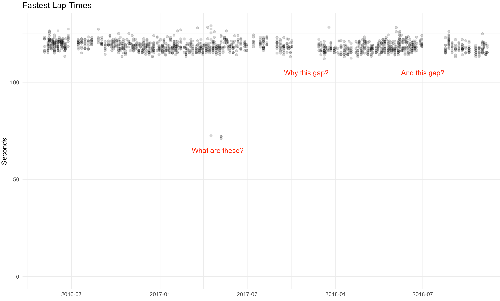

Before starting on any statistical analysis, it is important to know  the quality of the data upon which the analysis will be based. We can perform a data quality assessment that provides overall assessments and recommendations for improving data quality. 

Data quality is a continuum. The quality of a data set must be assessed with respect to its intended use, and the potential impact of any results derived from the data. 

Attempts to predict fastest lap times based on this data may prove difficult if the anomalies in the data are not addressed.