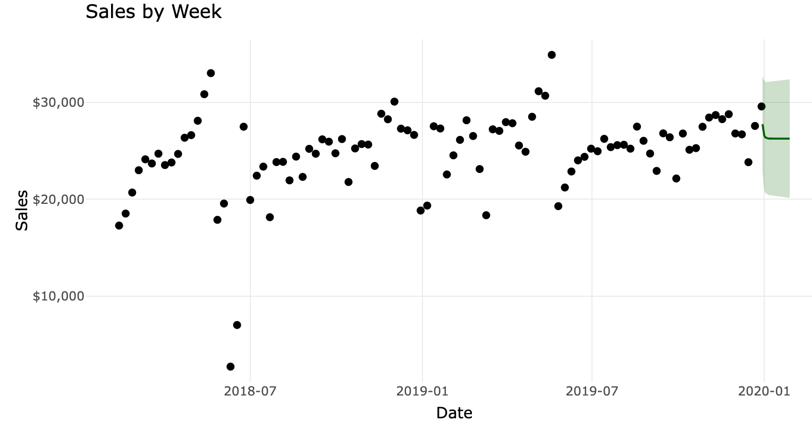

Forecasts of sales, costs, and cash flow are essential tools for your business planning.  

Forecasts should always include an indication of the uncertainty in the predictions (shown in green below) so that you can plan for each likely outcome. Think of forecasts as possible futures, from which you can assess different business outcomes and make decisions based on their likelihoods.

Forecasts can be done for your business to understand demand, costs, or any other metrics.

We can also perform impact analyses that help determine the effect of an intervention on any metric, for example the impact of an advertising campaign on your sales.

