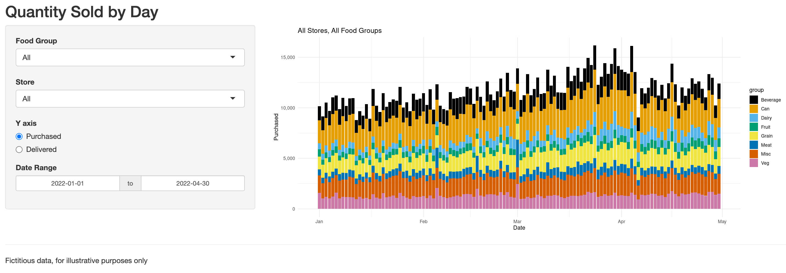

This project, for the Ottawa Food Bank, had the goal of understanding demand for different types of food in the different Ottawa wards, over time. 

We built a custom app to aid with this task. One of the most interesting insights found was that the Ottawa Food Bank was **providing diapers for one-fifth of the two month old babies in the Rideau Vanier ward**. This statement could then be used in showing donors the huge impact they were having in the community.

Similar analyses can be done for any business to understand demand for its products.

